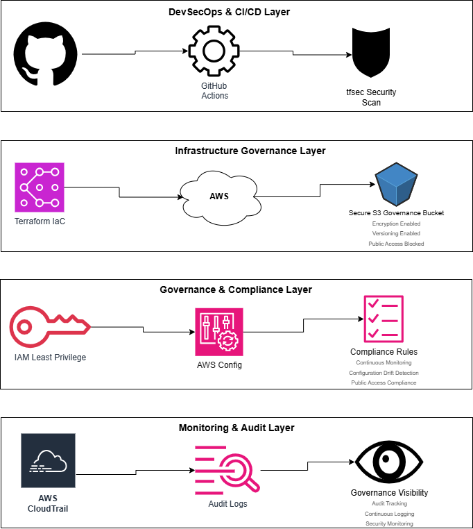

# Cloud Governance Platform
Cloud Governance | DevSecOps | Terraform | AWS Security | Compliance Automation

## Cloud Governance Architecture



## Overview

The Cloud Governance Platform is a cloud governance and DevSecOps project designed to demonstrate secure Infrastructure-as-Code (IaC), automated compliance validation, and governance-focused AWS resource management.

The environment was built using Terraform and AWS governance services to support secure cloud deployments, continuous monitoring, audit visibility, and infrastructure security validation through CI/CD automation.

The project emphasizes practical governance engineering concepts including least privilege access, audit logging, configuration compliance monitoring, infrastructure validation, and automated security scanning.

---

# Governance Objectives

- Deploy AWS infrastructure securely using Terraform
- Implement governance-focused cloud controls
- Automate infrastructure validation through CI/CD
- Integrate security scanning into deployment workflows
- Document security findings and remediation efforts
- Build a reusable governance automation framework
- Implement audit logging with AWS CloudTrail
- Enable configuration compliance monitoring with AWS Config
- Apply IAM least privilege governance controls

---

# Technologies Used

- Terraform
- AWS S3
- GitHub Actions
- tfsec
- Git
- VS Code
- AWS CLI
- AWS IAM
- AWS Config
- AWS CloudTrail
- diagrams.net (draw.io)

---

# Implemented Governance Controls

## S3 Governance Controls

- Server-side encryption enabled
- Public access blocked
- Bucket versioning enabled
- Infrastructure tagging standards implemented

## IAM Governance Controls

- IAM least privilege policy implementation
- Governance-focused access management

## Compliance & Monitoring Controls

- AWS Config compliance rule monitoring
- Configuration drift detection
- Continuous governance visibility

## Audit & Logging Controls

- AWS CloudTrail audit logging enabled
- Centralized governance log collection

## DevSecOps Controls

- Automated Terraform validation
- CI/CD pipeline automation
- tfsec infrastructure security scanning
- Git-based infrastructure change tracking

---

# CI/CD Pipeline

The GitHub Actions workflow automatically performs:

1. Terraform formatting validation
2. Terraform initialization
3. Terraform configuration validation
4. tfsec infrastructure security scanning

This pipeline supports continuous governance validation and infrastructure security assessment.

---

# Security Findings Management

Automated tfsec scanning identified governance recommendations including:

- KMS customer-managed encryption improvements
- S3 access logging recommendations

Findings and remediation tracking are documented within the project.

---

# Repository Structure

```text
cloud-governance-platform/
│
├── .github/workflows/
├── terraform/
├── evidence/
├── docs/
├── policies/
└── pipelines/
```

---

# Evidence Collection

The project includes deployment evidence and governance screenshots demonstrating:

- AWS infrastructure deployment
- Terraform execution
- Security control implementation
- GitHub Actions pipeline execution
- tfsec scanning results
- Governance architecture visualization

---

# Future Enhancements

Planned improvements include:

- AWS Security Hub integration
- Policy-as-Code implementation
- Multi-environment Terraform deployment strategy
- Automated compliance reporting
- Advanced governance dashboards

---

# Governance Monitoring & Compliance

The platform integrates AWS Config, CloudTrail, Terraform validation, and tfsec security scanning to support continuous governance monitoring and infrastructure compliance assessment.

The CI/CD workflow validates Terraform configurations and performs automated infrastructure security scanning during repository updates, helping identify governance and security issues early in the deployment lifecycle.

---

# Author

Juliet Rodriguez

Cloud Governance | DevSecOps | Infrastructure Security